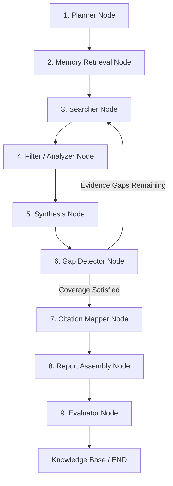

# REX Deep Research Agent — Technical Architecture & Workflow Documentation

**System Version:** 2.0.0  
**Generated Date:** July 29, 2026  
**Scope:** Complete Architecture, Multi-Agent Workflow, Inter-Agent Protocols, and Data Pipelines  

---

## 1. Executive Overview

**REX (Recursive Exploration eXplorer)** is an advanced multi-agent deep research platform engineered to automate high-depth academic, technical, and market intelligence gathering. The system accepts unstructured complex queries, decomposes them into targeted research sub-questions, executes parallel web/database scrapers, filters low-credibility sources, synthesizes structured analytical reports with verified inline citations, and performs self-reflective quality scoring.

---

## 2. System Stack & Architecture

| Layer | Component / Tech | Purpose & Responsibilities |
|---|---|---|
| **Frontend** | Next.js 14 App Router, TypeScript, Tailwind CSS, Framer Motion | Interactive UI, 9-stage progress tracking dashboard, real-time live telemetry stream, PDF/HTML/JSON report exports. |
| **Backend API** | FastAPI, Uvicorn, Python 3.11+, Server-Sent Events (SSE) | Async REST API endpoints (`/api/v1/research`), session state tracking, HTTP response streaming (`StreamingResponse`). |
| **Agent Framework** | LangGraph (`StateGraph`), LangChain Core | Stateful DAG agent graph orchestration, message reducers, conditional gap-fill loop execution. |
| **LLM & Embeddings** | Ollama (`qwen2.5:3b`, `phi3:mini`, `nomic-embed-text`), External API LLMs | Decomposing queries, evidence filtering, section synthesis, self-reflection evaluation. |
| **Data & Vector Store** | Supabase Vector DB, Local SQLite (`local.db`), Symbolic Knowledge Graph | Storing/retrieving historical research lessons, semantic vector matching, local session state storage. |
| **Search & Scraping** | DuckDuckGo (`ddgs`), Wikipedia API, Playwright Headless Browser, Jina Reader | Parallel multi-source Web search execution, JavaScript rendering, boilerplate-free content extraction. |

---

## 3. 9-Stage Multi-Agent Workflow Architecture

The research pipeline runs as a 9-node state machine within LangGraph:



### Node Descriptions & Responsibilities

1. **Planner Node (`planner`)**
   - Analyzes query topic type (*stable technical*, *emerging trend*, *company product*, *policy debate*).
   - Generates 4–8 structured sub-questions targeting distinct analytical angles.

2. **Memory Retrieval Node (`memory_retrieval`)**
   - Embeds query using `nomic-embed-text`.
   - Performs hybrid vector search against Supabase `knowledge_base` and local Knowledge Graph to retrieve relevant past lessons learned.

3. **Searcher Node (`searcher`)**
   - Launches parallel fetchers (DuckDuckGo, Wikipedia API, arXiv, direct scrapers).
   - Collects raw HTML/Markdown content across all sub-question tracks.

4. **Filter / Analyzer Node (`filter`)**
   - Applies domain blocklists (`vixra.org`, `tradingview.com`) and keyword filters.
   - Chunks text into ~1500 character snippets and scores vector relevance against sub-questions.

5. **Synthesis Node (`synthesis`)**
   - Synthesizes top-ranked evidence chunks into coherent section drafts for each track.

6. **Gap Detector Node (`gap_detector`)**
   - Evaluates whether synthesized sections thoroughly answer all sub-questions.
   - If gaps exist (and iteration count < max threshold), routes control back to **Searcher Node**; otherwise proceeds to **Citation Mapper**.

7. **Citation Mapper Node (`citation_mapper`)**
   - Maps source URLs to bracketed inline numeric citations `[N]`.
   - Generates verified reference links and source metadata.

8. **Report Node (`report_node_id`)**
   - Assembles full report structure: Executive Summary, Methodology, Core Findings, Key Statistics, Strategic Implications, and Reference Table.

9. **Evaluator Node (`evaluator`)**
   - Scores final report across 5 quality dimensions (0–10 scale).
   - Extracts a structured "Lesson Learned" and persists it into vector storage for future recall.

---

## 4. Inter-Agent Communication Protocols

Inter-agent communication in REX relies on **LangGraph State-Driven Message-Passing**:

```python
class AgentState(TypedDict):
    messages: Annotated[List[Any], operator.add]
    query: str
    sub_questions: List[str]
    raw_pages: Dict[str, str]
    scored_chunks: List[Dict[str, Any]]
    synthesis_results: List[Dict[str, Any]]
    gap_results: List[Dict[str, Any]]
    gap_iteration: int
    cited_report: str
    report: str
    findings: Annotated[List[str], operator.add]
    feedback: str
    prior_lessons: List[str]
    retrieved_memory: List[Dict[str, Any]]
    metrics: Dict[str, Any]
    logs: Annotated[List[str], operator.add]
    active_node: str
```

### Communication Protocol Highlights
- **State Mutation**: Each node receives the full `AgentState` object, performs node-specific operations, and returns a dictionary of updated state keys.
- **Additive State Reducers**: Fields like `findings` and `logs` use `operator.add` to cleanly aggregate data across multiple nodes without overwriting prior outputs.
- **SSE Client Streaming**: The backend converts internal node transitions and thoughts into Server-Sent Events (`data: {"node": "searcher", "message": "..."}

`) pushed via HTTP streaming to the frontend.

---

## 5. Quality Evaluation & Telemetry Metrics

Reports are evaluated automatically on a 0–10 scale:

- **Relevance**: Alignment of findings with original user prompt.
- **Depth**: Technical detail, comprehensiveness, and density of quantitative data.
- **Novelty**: Insightfulness and presence of non-trivial analytical synthesis.
- **Coherence**: Structural formatting, logical flow, and clean heading hierarchy.
- **Citation Accuracy**: Strict grounding of claims in verified source notes.

---

## 6. Execution & Deployment Setup

### Backend Server Launch
```bash
cd backend
python main.py  # Runs FastAPI on http://127.0.0.1:8000
```

### Frontend Server Launch
```bash
cd frontend
npm run dev     # Runs Next.js on http://localhost:3000
```

### Combined Startup Script
Run `start_servers.bat` from root workspace directory.
