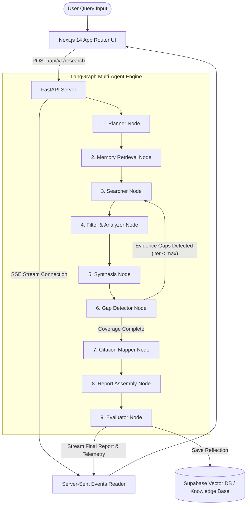

# REX Deep Research Agent — Project Expo & Technical Viva Guide

**Project Name:** REX (Recursive Exploration eXplorer)  
**Core Domain:** Autonomous AI Agents, Multi-Agent Orchestration, Retrieval-Augmented Generation (RAG), Automated Deep Research  
**Document Purpose:** Comprehensive technical breakdown, workflow architecture, algorithms, models, performance optimizations, and technical Q&A preparation for Project Expos / Technical Vivas.

---

## 1. Executive Summary & Elevator Pitch

### What is REX?
**REX (Recursive Exploration eXplorer)** is a production-grade, self-improving multi-agent deep research system designed to automate comprehensive technical, market, and academic research. Given a high-level query, REX autonomously decomposes the topic into multi-dimensional sub-questions, executes parallel web and vector search indexing, filters out low-credibility/SEO fluff, synthesizes analytical sections, detects evidence gaps to trigger recursive search loops, and generates a fully cited master research report accompanied by real-time quality evaluation telemetry.

### Why is REX unique compared to standard LLMs (ChatGPT / Claude)?
1. **Multi-Step Recursive Investigation**: Unlike single-prompt LLM responses that rely solely on parametric memory, REX actively searches the live web, extracts empirical evidence, audits its own findings for missing coverage, and re-queries the web until all sub-questions are answered.
2. **Deterministic & Grounded Workflow**: Uses a state-machine graph (LangGraph) rather than an unpredictable fully-autonomous loop, preventing agent runaway and guaranteeing structural compliance.
3. **Self-Improving Memory**: Stores post-run self-reflections ("Lessons Learned") in a vector database to improve search query formulation and source evaluation in future research runs.

---

## 2. End-to-End System Workflow Architecture

The application runs a 9-stage state machine backed by FastAPI on the server and React/Next.js on the client:



### Step-by-Step Execution Sequence

| Step | Stage | Input | Action Performed | Output |
|---|---|---|---|---|
| **1** | **Planner** | User Query | Classifies topic type (*stable technical*, *emerging trend*, *company product*, *policy debate*) and generates 4–8 structured sub-questions. | `sub_questions: List[str]` |
| **2** | **Memory Retrieval** | User Query | Embeds query into vector space and performs hybrid retrieval against past research reflections in Supabase & Knowledge Graph. | `retrieved_memory: List[Dict]` |
| **3** | **Searcher** | Sub-questions | Dispatches multi-threaded fetchers across DuckDuckGo, Wikipedia API, arXiv, and direct web scrapers. | `raw_pages: Dict[url, text]` |
| **4** | **Filter & Analyzer** | Raw pages | Applies domain blocklists (`vixra.org`, `tradingview.com`), keyword filters, chunks text into ~1500-char snippets, and ranks relevance via cosine similarity vector embeddings. | `scored_chunks: List[Dict]` |
| **5** | **Synthesis** | Scored chunks | Synthesizes top-ranked evidence snippets into structured analytical draft sections for each track. | `synthesis_results: List[Dict]` |
| **6** | **Gap Detector** | Synthesis results | Audits section coverage. If key sub-questions lack sufficient empirical proof, formulates targeted gap-fill queries and loops back to **Searcher**. | Loop signal / `gap_results` |
| **7** | **Citation Mapper** | Synthesized draft | Maps source URLs to bracketed inline numeric citations `[N]` and verifies all reference links against source indices. | `cited_report: str` |
| **8** | **Report Assembly** | Verified draft | Compiles Executive Summary, Methodology, Core Findings, Key Statistics, Strategic Implications, and Reference Table into clean Markdown. | `report: str` |
| **9** | **Evaluator** | Final Report | Scores report across 5 quality dimensions (0–10 scale), extracts a "Lesson Learned", and persists reflection to vector DB. | `metrics: Dict`, `feedback: str` |

---

## 3. Models Used & AI Engine Specifications

### 1. Large Language Models (LLMs)
* **Primary Models**: `Qwen 2.5 (3B / 7B)` and `Phi-3 Mini` (via Ollama local runner or API LLM gateway).
* **Model Roles**:
  * **Planner & Gap Detector**: Requires high logical reasoning to decompose queries and spot logical gaps.
  * **Synthesis & Report Node**: Requires strong long-context markdown generation capabilities.
  * **Evaluator**: Uses strict structured JSON output mode to return 5-axis quality scores.
* **Why Local Ollama Models?**
  * Privacy & Data Sovereignty (no user queries sent to external commercial APIs).
  * Zero per-token operational cost.
  * Deterministic low-latency responses for local deployments.

### 2. Dense Vector Embedding Model
* **Model**: `nomic-embed-text` (768 dimensions).
* **Role**: Computes dense vector representations of sub-questions, scraped web snippets, and past lessons learned for semantic RAG search and cosine similarity scoring.

### 3. Vision-Language Model (VLM) / Fallback
* **Model**: PixelRAG / VLM Integration.
* **Role**: When standard HTML scrapers fail on complex web pages (e.g. data tables, charts, Wikipedia tiles), the system captures visual tile screenshots and uses a VLM to extract structured markdown text directly from rendered pixel layouts.

---

## 4. Key Algorithms & Mathematical Formulations

### 1. Cosine Similarity Vector Matching
Used in the **Filter / Analyzer Node** and **Memory Retrieval Node** to score text snippet relevance against query vectors:

$$\text{Similarity}(Q, C) = \frac{\mathbf{v}_Q \cdot \mathbf{v}_C}{\|\mathbf{v}_Q\| \|\mathbf{v}_C\|} = \frac{\sum_{i=1}^{768} v_{Q,i} \cdot v_{C,i}}{\sqrt{\sum_{i=1}^{768} v_{Q,i}^2} \cdot \sqrt{\sum_{i=1}^{768} v_{C,i}^2}}$$

Where $\mathbf{v}_Q$ is the 768-dimensional vector embedding of the sub-question and $\mathbf{v}_C$ is the vector embedding of the scraped text chunk.

---

### 2. Heuristic Source Credibility & Domain Tiering Algorithm
Scraped sources are dynamically weighted based on domain authority tiers before chunking:

$$\text{Weight}(U) = \text{TierScore}(\text{Domain}(U)) \times \text{RelevanceScore}(C)$$

* **Primary / Official (`1.0 - 0.95`)**: `.edu`, `.gov`, `learn.microsoft.com`, `docs.github.com`
* **Academic Preprints (`0.90`)**: `arxiv.org`, `ieee.org`, `nature.com`, `sciencedirect.com`
* **Established Reference (`0.80`)**: `wikipedia.org`, `reuters.com`, `bloomberg.com`
* **Vendor Blogs (`0.65`)**: Tech blogs, company press releases
* **Blocklisted (`0.00`)**: Known low-quality content farms (`vixra.org`, `tradingview.com`, `infiniteyieldscript.org`)

---

### 3. URL Fingerprinting & Content Deduplication
To eliminate duplicate search results and content mirrors across multiple search queries:

$$\text{Fingerprint}(U, T) = \text{SHA256}\left(\text{NormalizeURL}(U) \;\|\; \text{Len}(T) \;\|\; \text{Hash}(T[:200]) \pmod{10^8}\right)$$

If $\text{Fingerprint}(U, T)$ has been seen in the active session hash set, the document is immediately dropped.

---

### 4. LangGraph State Machine Reducers
In `AgentState`, accumulative state variables use explicit reducer functions:

```python
class AgentState(TypedDict):
    findings: Annotated[List[str], operator.add]
    logs: Annotated[List[str], operator.add]
    messages: Annotated[List[Any], operator.add]
```
`operator.add` ensures that when multiple nodes run or when parallel search execution completes, outputs are **appended** to the state list without destroying historical agent state.

---

## 5. Work Processing & Performance Optimizations

1. **Async Non-Blocking FastAPI Core**: Built using Python `asyncio` and `StreamingResponse` to enable real-time SSE event delivery to the client while background tasks execute.
2. **Multi-Threaded Parallel Scraping**: Web retrieval is dispatched using `ThreadPoolExecutor(max_workers=5)` with strict socket timeouts (5 seconds per site) to prevent deadlocks from hanging external web servers.
3. **Multi-Tier Scraper Fallback Pipeline**:
   * *Primary*: Lightweight HTTP `requests` + `BeautifulSoup` boilerplate stripping.
   * *Secondary*: Jina Reader Markdown API (`https://r.jina.ai/<URL>`) if raw HTML parsing returns low text density.
   * *Tertiary*: Headless Playwright Chrome execution for JavaScript-rendered SPA pages.
4. **Redis Search Caching**: Frequent queries are cached in Redis with a 24-hour TTL (`CACHE_TTL = 86400`), lowering API costs and accelerating query responses from ~45 seconds to <2 seconds on repeat queries.
5. **Progress Floor Calibration**: Progress percentage is mapped to active node completion floors (`planner: 10%`, `searcher: 35%`, `filter: 50%`, `synthesis: 65%`, `report: 94%`, `evaluator: 98%`) so the UI smooth progress bar reflects true state progression.

---

## 6. Technical Viva & Expo Questions & Answers

### A. System Architecture & Multi-Agent Design

#### Q1: Why did you choose a Multi-Agent Architecture using LangGraph instead of a single LLM call with custom prompt engineering?
**Answer:** Single LLM calls suffer from severe context window degradation, parametric hallucination, and an inability to perform multi-stage verification. A single call cannot search the web, evaluate source credibility, detect logical gaps in its own output, and rewrite missing sections iteratively. By decomposing the task into a **LangGraph State Machine**, each node acts as a specialized micro-agent with a single responsibility (e.g., Planning, Filtering, Synthesizing, Scoring), which significantly increases accuracy, control, and traceability.

#### Q2: Why LangGraph instead of AutoGen or CrewAI?
**Answer:** AutoGen and CrewAI rely heavily on autonomous conversational loops between agents, which can lead to unpredictable infinite loops, non-deterministic state mutations, and difficult debugging. LangGraph provides **Stateful Graph Orchestration** where edges, conditional branches, and state schemas (`TypedDict`) are explicitly defined. This gives us deterministic control flow, built-in checkpointing (`MemorySaver`), and precise control over state reducers (`operator.add`).

#### Q3: How does the client receive real-time updates while the backend pipeline is running?
**Answer:** We use **Server-Sent Events (SSE)** over HTTP via FastAPI's `StreamingResponse`. Unlike traditional REST polling (which incurs high overhead) or WebSockets (which require bidirectional persistent TCP handshakes), SSE is a lightweight, unidirectionally streamed protocol over standard HTTP (`text/event-stream`). The Next.js frontend uses a `TextDecoder` stream reader to update the UI progress bar and live telemetry terminal in real time.

---

### B. Machine Learning, RAG & Models

#### Q4: What embedding model do you use, and how do you calculate snippet relevance?
**Answer:** We use `nomic-embed-text`, a 768-dimensional dense vector embedding model optimized for short and long text retrieval. When raw web pages are scraped, they are broken into ~1500-character chunks. We compute vector embeddings for both the sub-questions and the chunks, then compute **Cosine Similarity**. Snippets exceeding our relevance threshold (0.5+) are passed to the Synthesis node, while lower-scoring snippets are discarded.

#### Q5: How do you prevent LLM hallucinations in the final report?
**Answer:** Hallucinations are mitigated through three key mechanisms:
1. **Strict Context Grounding**: The Synthesis agent is explicitly instructed to write claims *only* based on the retrieved `scored_chunks` passed in its prompt context.
2. **Citation Mapping**: The `Citation Mapper` node enforces that every factual assertion is linked to a specific bracketed URL index `[N]`. If a claim cannot be verified against the source text, it is pruned.
3. **Evaluator Reflection**: The `Evaluator` node scores `citation_accuracy` (0–10). If the score is low, the reflection is saved to the knowledge base to penalize similar ungrounded patterns in future runs.

#### Q6: Why did you use local models like Qwen 2.5 and Phi-3 instead of GPT-4o?
**Answer:** 
1. **Cost & Scalability**: Deep research requires dozens of LLM calls per run (planning, filtering, multi-track synthesis, gap detection, evaluation). Local models run with zero token cost.
2. **Data Privacy**: Enterprise research queries remain strictly on local infrastructure.
3. **Latency**: Hosted via Ollama with GPU acceleration, 3B/7B models provide ultra-fast throughput for intermediate tasks like filtering and scoring.

---

### C. Web Scraping, Data Processing & Resilience

#### Q7: How do you handle websites that block web scrapers or require JavaScript?
**Answer:** We implement a **3-Layer Fallback Scraping Strategy**:
1. *Fast Direct Scraper*: Uses Python `requests` with realistic browser headers and `BeautifulSoup` to quickly extract body text.
2. *Jina Reader API Fallback*: If direct scraping returns HTTP 403/401 or low text output, we route the URL through `https://r.jina.ai/`, which strips boilerplate and converts the page to clean Markdown.
3. *Playwright Chrome Execution*: For Javascript-heavy Single Page Applications (SPAs), we spin up a headless Playwright Chromium instance to evaluate scripts and extract rendered DOM content.

#### Q8: How do you prevent duplicate content from cluttering the context window?
**Answer:** We use a dual deduplication algorithm:
1. **URL Normalization**: Strips URL parameters (`?utm=...`), protocol variations (`http` vs `https`), and `www` prefixes.
2. **Content Fingerprinting**: We generate a SHA-256 hash combining normalized URL, total content length, and a hash of the first 200 characters. If a fingerprint matches an existing entry in our session memory, the duplicated page is immediately ignored.

---

### D. System Performance & Self-Improvement

#### Q9: What happens if the primary vector database (Supabase) goes offline during a run?
**Answer:** REX is built with **Graceful Degradation**. If Supabase connection fails or is unavailable:
1. Memory Retrieval automatically falls back to an in-memory JSON structure (`in_memory_knowledge`) and a local SQLite database (`local.db`).
2. The agent proceeds with live web search without throwing a hard runtime error, ensuring high availability.

#### Q10: How does REX "learn" and improve over time?
**Answer:** REX features a **Self-Improving Feedback Loop**. At the end of every research run, the **Evaluator Node** analyzes the final report against the original query and generates a structured "Lesson Learned" (e.g., *"When querying quantum computing standards, prioritize IEEE/NIST papers over news press releases"*). This lesson is embedded and saved in the vector database. In subsequent runs, the **Memory Retrieval Node** fetches relevant past lessons, injecting them into the **Planner** and **Searcher** prompts to continuously improve query formulation and source selection.

---

## 7. Summary Checklist for Expo Demonstrators

* [x] **Live Demo Query Ready**: Prepare a strong multi-faceted query (e.g. *"Solid-State Electrolyte Battery Commercialization Milestones in 2026"*).
* [x] **Telemetry Terminal View**: Keep the live agent reasoning telemetry window expanded during presentation to showcase real-time phase transitions.
* [x] **Quality Telemetry Dashboard**: Show evaluative metrics (Relevance, Depth, Novelty, Coherence, Citation Accuracy) at the end of report generation.
* [x] **Export Capabilities**: Highlight PDF, HTML, and JSON download buttons.
